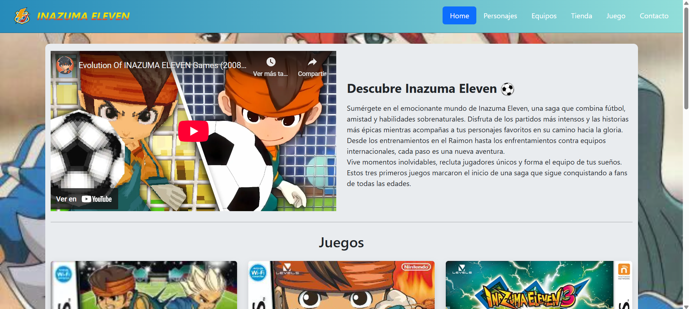
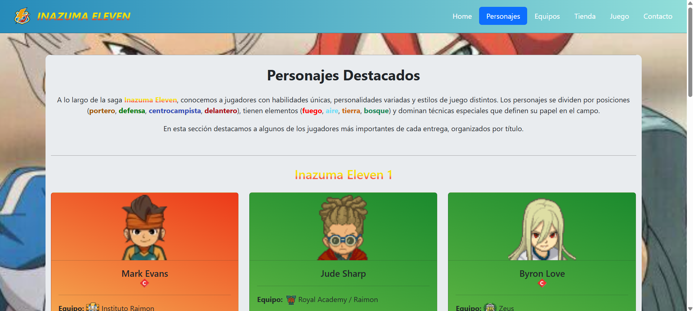
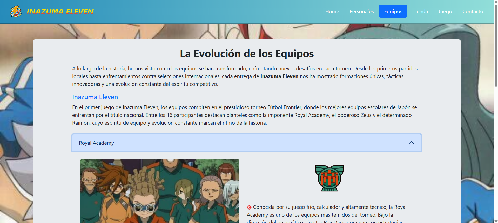
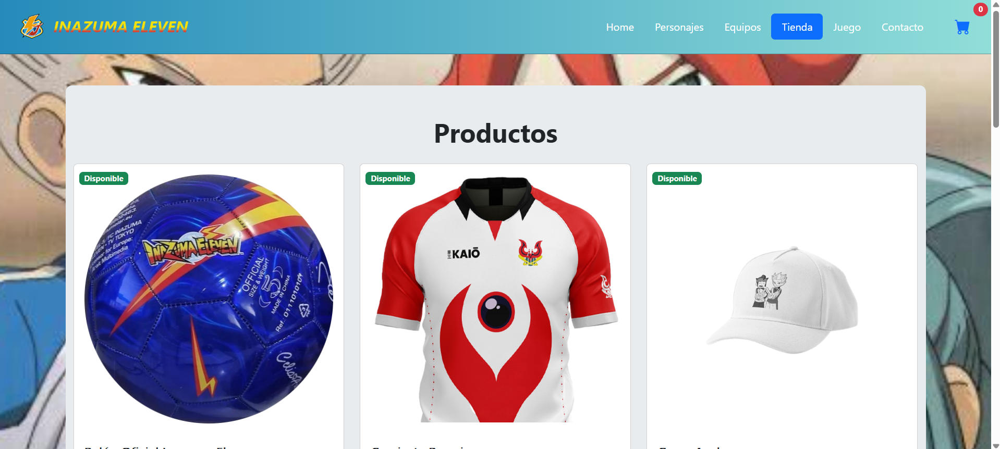
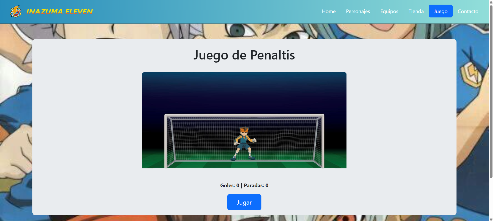
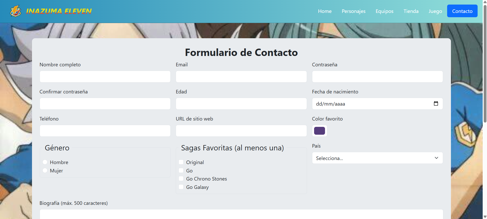

# ⚡ Inazuma Eleven - Proyecto Web ⚽


🎮 **Bienvenido al mundo de Inazuma Eleven**, una saga que combina fútbol con habilidades sobrenaturales y pura emoción. Esta página web rinde homenaje al anime y videojuegos que nos hicieron soñar con el "fútbol extremo" ⚡💥.

---

## 🌐 ¿Qué encontrarás en el sitio?

- 🏠 **Home** – Introducción al universo de Inazuma Eleven. 
- 👥 **Personajes** – Fichas detalladas de los jugadores más icónicos.
- 🏆 **Equipos** – Historia y datos de cada equipo.
- 🥅 **Juego** – ¡Ataja o anota penaltis al estilo Inazuma!
- 🛒 **Tienda** – Productos exclusivos de la saga.
- 📬 **Contacto** – Formulario interactivo para sugerencias y mensajes.

---

## 📂 Secciones del Sitio

### 🏠 Home

- ✨ Presentación general de la saga.
- 🕹️ Sección de juegos para Nintendo.
- 🎞️ Galería de gifs animada.



---

### 👥 Personajes

- 📸 Imagen de cada jugador.
- 🎯 Posición en el campo.
- 💫 Técnicas especiales únicas.



---

### 🏆 Equipos

- 📚 Información organizada por equipos.
- 🎛️ Acordeones interactivos para descubrir detalles.  



---

### 🛒 Tienda

- 🧢 **Catálogo visual**: camisetas, balones, etc...
- 🛍️ Carrito de compras. 



---

### 🥅 Juego Interactivo

- 🧤 Minijuego de penaltis en JavaScript.
- 🎯 Puntajes por goles/paradas.
- ⚙️ Dinámica fácil y entretenida.



---

### 📬 Contacto

- 📝 Formulario con validación avanzada.
- ✅ Mensajes dinámicos de éxito y error.



---

## 🛠️ Tecnologías utilizadas

### 🔧 Frontend
- 🌐 **HTML5**.
- 🎨 **CSS3** (con animaciones propias).
- 🧠 **JavaScript** (para interacciones y lógica del juego).
- 📱 **Bootstrap 5** (diseño responsive).
- 🖼️ **Bootstrap Icons**.

---

## 🗂️ Estructura del proyecto

WEBTEMATICA/
├── css/
│   ├── bootstrap.css
│   └── style.css
├── img/
│   ├── Animaciones/
│   ├── Carátulas/
│   ├── Elementos/
│   ├── Equipos/
│   ├── Personajes/
│   ├── Posiciones/
│   ├── Tienda/
│   ├── capturasReadme/
│   ├── FAVICON.png
│   ├── capi.png
│   └── Fondo.png
├── js/
│   ├── bootstrap.bundle.js
│   ├── juegoScript.js
│   └── script.js
├── index.html
├── personajes.html
├── equipos.html
├── juego.html
├── tienda.html
├── contacto.html
└── README.md

---

## 🚀 Instalación y uso

**1. 📥 Clona el repositorio:**
   ```bash
   git clone https://github.com/Mauri1658/WebTematica.git
   ```
**2.** 📂 Abre el archivo index.html en tu navegador web

**3.** 🔍 Explora y disfruta de cada sección

---

## 👨‍💻 Créditos

- 🧑‍🎨 **Diseño y desarrollo**: Mauri Pacheco & Álvaro Escudero

- 🖼️ **Contenido e imágenes**: Basado en la saga Inazuma Eleven de Level-5
